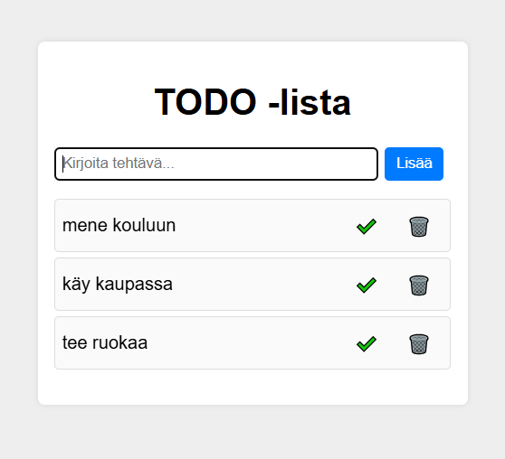

# Projektin nimi ja tekijät
Todo lista , tekijät: Esa Honkanen

## Verkkolinkit:
Pääset julkaistuun sovellukseen käsiksi osoitteessa [Esan Todo-sovellus](https://esantodosovellus.netlify.app/)
Linkki projektin videoesittelyyn [Todo sovellus esittylyvideo](https://video.laurea.fi/media/Todo+sovellus+esittely/0_wbxskrpn)

## Työn jakautuminen 
Tein tehtävän yksin.

## Oma arvio työstä ja oman osaamisen kehittymisestä
Mielestäni onnistuin tehtävässä ihan hyvin ja minimivaatimukset täyttyivät.
Parantamista olisi sovelluksen visuaalisuudessa.
Sovelluksesta jäi puuttumaan laskuri, joka laskee käynnissä olevien tehtävien määrän.
Koen, että olen oppinut paljon suhteutettuna tuntien määrään.
Antaisin itselleni pisteitä seuraavasti: 7/10 p

## Palaute opettajalle kurssista sekä itse opetuksesta tähän saakka
Kurssi on ollut tähän mennessä hyvä ja lähiopetuksesta on ainakin itselle ollut apua. Olen tykännyt siitä, että osaa tehtävistä käydään yhdessä läpi.

## Sisällysluettelo:

- [Tietoja sovelluksesta](#tietoja-sovelluksesta)
- [Tunnetut virheet/bugit](#Tunnetut virheet/bugit)
- [Kuvakaappaukset](#kuvakaappaukset)
- [Teknologiat](#teknologiat)
- [Asennus](#asennus)
- [Lähestymistapa](#lähestymistapa)
- [Kiitokset](#kiitokset)
- [Lisenssi](#lisenssi)

## Tietoja sovelluksesta
Todo-lista on sovellus, johon voi lisätä listan tavoin asioita mitä pitäisi saada tehtyä. Asioita voi merkitä tehdyksi ja niitä voi poistaa.

## Tunnetut virheet/bugit
Testauksessa en huomannut bugeja.

## Kuvakaappaukset
Lisää tähän vähintään yksi kuvakaappaus toimivasta sovelluksesta  

## Teknologiat
Projektissa on käytetty html, css sekä Javascriptiä.

## Asennus 
- Mene osoitteeseen https://esantodosovellus.netlify.app käyttääksesi sovellusta
- lataa Projekti 1 kansion tiedostot ja avaa index.html selaimessasi  
- lataa tai kloonaa repositorio  

## Kiitokset
Projektissa on käytetty apuna kurssin sisältöä, W3schoolia, Youtubea sekä Chatgpt:tä. Chatgpt:tä käytetty lähinnä virheiden korjaamiseen ja css tyyleihin. W3school ja kurssin sisältöä käytin perusasioden kertaamiseen. Katsoin myös satunnaisia youtube videoita.  
- [Chatgpt](https://chatgpt.com)  
- [W3Schools](https://W3schools.com)